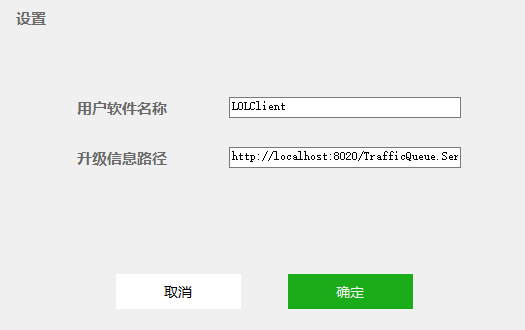
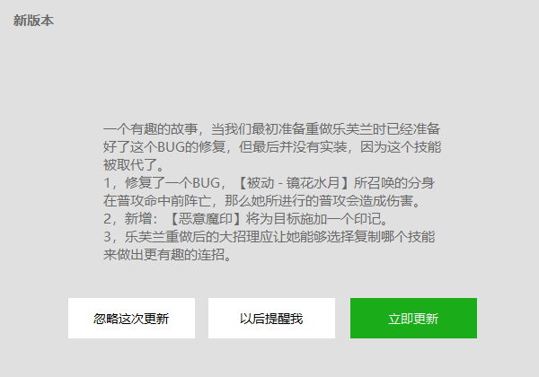

<p align="center">
  <a>
    
  </a>

  <h3 align="center">HHUpdateApp</h3>
  <p align="center">
    轻松地将自动更新升级功能添加到经典桌面应用程序项目中
    <br />
    <a href="https://github.com/micahh28/HHAutoUpdate.NET/releases">Release版本</a>
    ·
    <a href="https://github.com/micahh28/HHAutoUpdate.NET/issues">报告Bug</a>
    ·
    <a href="https://github.com/micahh28/HHAutoUpdate.NET/pulls">提出新特性</a>
  </p>

</p>

## 目录

- [上手指南](#上手指南)
- [如何运作](#如何运作)
- [开发者使用](#开发者使用)
- [示例](#示例)
- [作者](#作者)
- [版权说明](#版权说明)
- [相关](#相关)


### 上手指南
HHUpdateApp是.NET程序桌面应用程序。她可以轻松地将自动更新升级功能添加到经典桌面应用程序项目中。可能是西宋区域（我滴老噶）最具影响力的自动升级方式（恩，我们村应该就我一个）。

下载Releases中最新安装包，即刻体验全部功能，你无需涉足各种脚本工具，只需面对你所需要升级的程序本身，让你的应用程序轻松获得自动升级的特性。

在上手前，有些名词是需要我们了解的。
- 升级程序：HHUpdateApp.exe是一个可执行程序，她提供了升级支持。下面文档中的【升级程序】代指HHUpdateApp.
- 业务程序：是指你自己的程序，例如你有一个LOLClient.exe程序，我们称它为业务程序.
- HHUpdateApp.exe.config：升级程序的参数配置，里面包含【升级程序】工作时所需要的一些参数，祥见[开发者使用](#开发者使用)
- HHversions.json：升级版本信息文件，这个文件包含了【业务程序】的升级信息，它是json格式的文件，放置在远端电脑或服务器上，【升级程序】升级时，会请求该文件，以获得升级信息.

### 如何运作
【升级程序】从您的服务器下载包含更新信息的JSON文件(HHversions.json)。它使用此JSON文件来获取需要检测更新的PC上【业务程序】有关最新版本的信息。如果服务器上该【业务程序】的最新版本大于在用户PC上的当前版本，则HHUpdateApp将向用户显示更新对话框。如果用户按下更新按钮来更新软件，则它将从【HHversions.json)】文件中提供的URL下载更新文件（zip文件）。之后执行更新是安装程序的工作，HHUpdateApp会将zip文件的内容提取到应用程序目录中替换升级原应用程序文件。

直接点击【HHUpdateApp.exe】，只需要填写【业务应用程序名称】（例如LOLClient）即可体验的为你的LOLClient.exe应用程序检查更新。


### 开发者使用
### 1，配置HHUpdateApp.exe.config
配置升级程序，此处是HHUpdateApp.exe运行是需要的一些参数，可以手动配置好。如果没有配置，更新程序运行时，会进入配置页，要求配置。两种方式均可以。
```xml
<HHUpdateApp.Properties.Settings>
			<!--业务应用程序名称：根据这个值，找到业务应用程序，并为它赋予自动更新的功能-->
			<setting name="LaunchAppName" serializeAs="String">
				<value />
			</setting>
			<!--服务地址：HHUpdateApp.exe将下载此处提供的HHversions.json文件（包含版本更新信息的JSON文件）-->
			<setting name="ServerUpdateUrl" serializeAs="String">
				<value>http://localhost:8020/HHversions.json</value>
			</setting>
			<!--非必要参数，用于记录忽略的一个版本号：检查更新时会忽略这个版本的更新-->
			<setting name="LocalIgnoreVer" serializeAs="String">
				<value />
			</setting>
			<!--非必要参数，是否静悄悄升级：true,更新过程中不显示界面；false,显示更新界面-->
			<setting name="SilentUpdate" serializeAs="String">
				<value>False</value>
			</setting>
</HHUpdateApp.Properties.Settings>
```
### 2，在【应用程序】中添加代码以使其对HHUpdateApp发起调用
添加调用检测升级更新的方法，以winform程序为例，在应用程序中添加｛检查更新｝按钮，该检查更新按钮，代码如下

|  参数   | 类型  |  说明  |
|  ----  | ----  |  ----  |
| FileName  | sting |【升级程序】HHUpdateApp.exe程序所在路径
| Arguments  | sting[] |参数数组:Arguments[0]:发起更新的名称（例如，LOLClient）；Arguments[1]：检查模式：0,定时检查；1，手动检查（区别就是，自动检查的状态下，如果有新版本更新，才会显示更新提示框,例如你的应用程序使用的是定时检查更新，那么建议使用 0,自动更新）

```csharp
    /// <summary>
    /// 检查更新按钮
    /// </summary>
    /// <param name="sender"></param>
    /// <param name="e"></param>
    private void button1_Click(object sender, EventArgs e)
        {
            ProcessStartInfo processStartInfo = new ProcessStartInfo()
            {
                FileName = "~\HHUpdateApp.exe",//参数:【升级程序】HHUpdateApp.exe程序所在路径
                Arguments = "LOLClient 1"//参数1:【应用程序】的名词，例如：LOLClient；参数1:检查更新模式
            ;
            Process proc = Process.Start(processStartInfo);
            if (proc != null)
            {
                proc.WaitForExit();
            }
        }
```

### 3，  HHversions.json
发布版本信息HHversions.json。将HHversions.json文件放在【升级程序】可访问的服务器或远程电脑上。升级版本信息文件，这个文件包含了【业务程序】的升级信息，它有固定的格式，如下所示.注意：HHversions.json必须是UTF8格式
```json
{
  "ApplicationStart": "更新工作结束后启动的业务程序名，多个启动用 # 号分割",
  "ReleaseDate": "发布时间",
  "ReleaseUrl": "zip更新包发布地址",
  "ReleaseVersion": "发布版本号",
  "UpdateMode": "更新方式：Cover表示覆盖原文件更新，NewInstall表示删除源文件全新安装",
  "VersionDesc": "更新描述说明",
  "IgnoreFile": "更新过程中忽略的文件，多个文件用 # 号分割"
}
```

### 示例



>上面示例中使用的代码片段

```csharp
/// <summary>
/// 检查更新按钮
/// </summary>
/// <param name="sender"></param>
/// <param name="e"></param>
private void button1_Click(object sender, EventArgs e)
        {
            string _updateAppPath = textBox1.Text;//输入升级程序所在目录

            if (File.Exists(_updateAppPath))//升级程序是否存在
            {
                ProcessStartInfo processStartInfo = new ProcessStartInfo()
                {
                    FileName = _updateAppPath,//路径
                    Arguments = "LOLClient 1"//此需要升级的应用程序名
                };
                Process proc = Process.Start(processStartInfo);
                if (proc != null)
                {
                    proc.WaitForExit();
                }
            }
        }
```
>上面示例中使用的HHversions.JSON文件

```json
{
  "ApplicationStart": "HHUpdate.Test.exe",
  "ReleaseDate": "2020520",
  "ReleaseUrl": "http://localhost:8085/UpdateDemo/Debug.zip",
  "ReleaseVersion": "1.0.0.1",
  "UpdateMode": "Cover",
  "VersionDesc": "一个有趣的故事，当我们最初准备重做乐芙兰时已经准备好了这个BUG的修复，但最后并没有实装，因为这个技能被取代了。\r\n1，修复了一个BUG，【被动 - 镜花水月】所召唤的分身在普攻命中前阵亡，那么她所进行的普攻会造成伤害。\r\n2，新增：【恶意魔印】将为目标施加一个印记。\r\n3，乐芙兰重做后的大招理应让她能够选择复制哪个技能来做出更有趣的连招。",
  "IgnoreFile": ""
}
```

### 作者

- [chadwuo](https://github.com/chadwuo)

### 版权说明

该项目签署了MIT 授权许可，详情请参阅 [LICENSE.txt](https://github.com/chadwuo/HHAutoUpdate.NET/blob/master/LICENSE)

### 相关

[更新日志](https://github.com/chadwuo/HHAutoUpdate.NET/releases)


